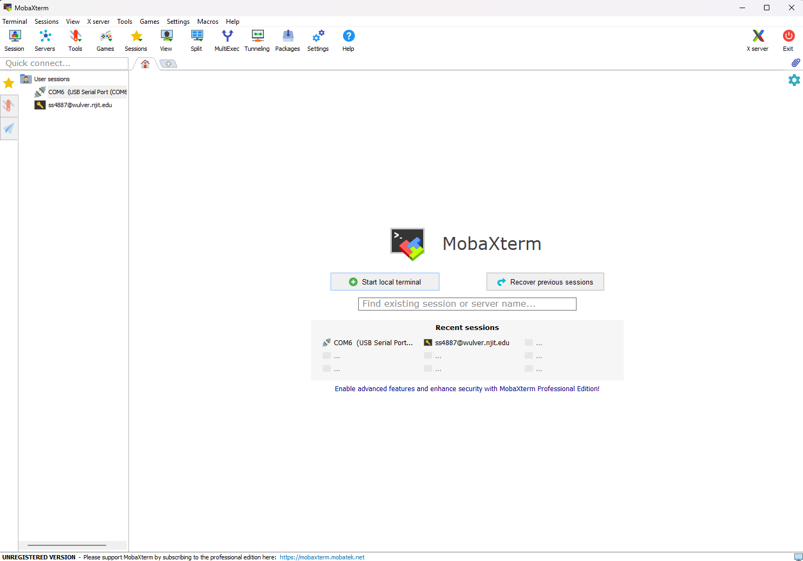
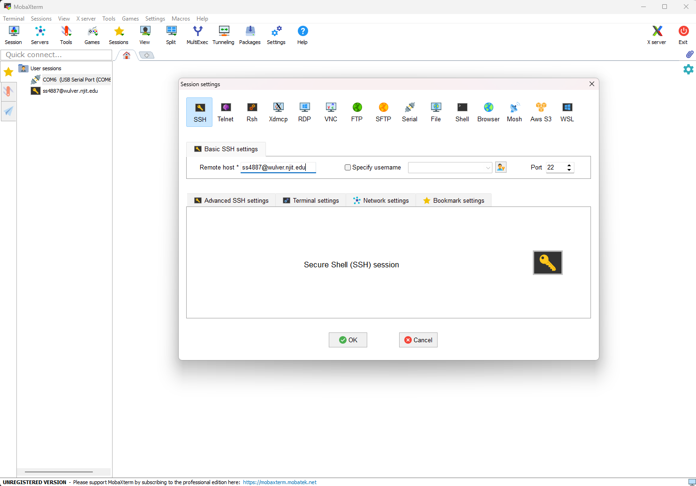
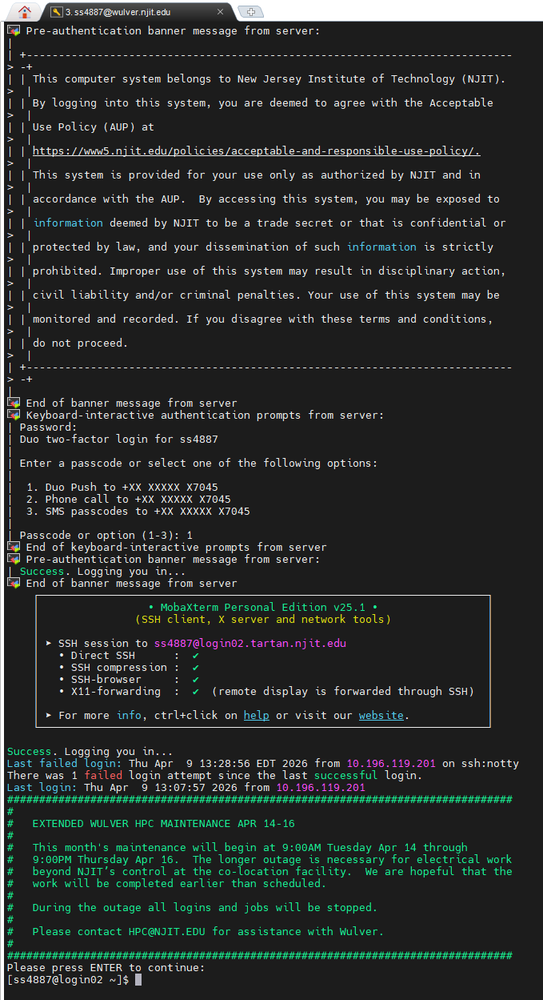
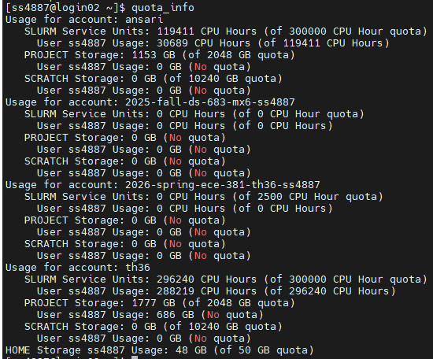
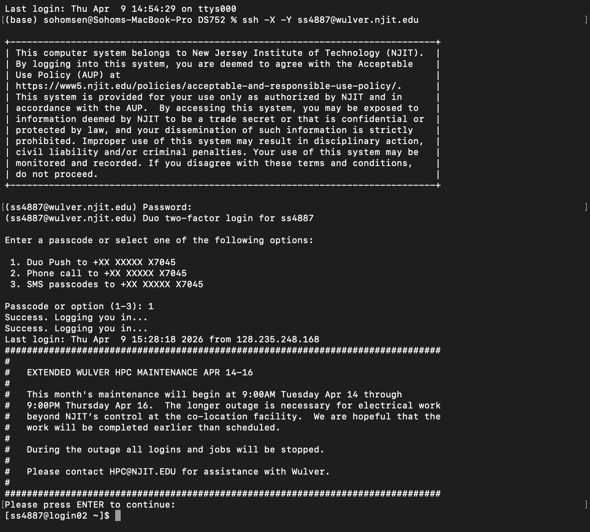

# Setting Up NJIT Wulver HPC

This guide walks you through connecting to the NJIT Wulver High-Performance Computing (HPC) cluster. Follow the section for your operating system.

---

## Table of Contents

- [Windows — MobaXterm](#windows--mobaxterm)
- [Linux / Mac — Terminal](#linux--mac--terminal)

---

## Windows — MobaXterm

MobaXterm is an enhanced terminal for Windows with a built-in X11 server, tabbed SSH client, and several network tools for remote computing. It brings all essential Unix commands to your Windows desktop in a single portable application.

---

### Step 1 — Download and Install MobaXterm

1. Go to: **https://ist.njit.edu/software-available-download**
2. Locate **MobaXterm** in the software list and download the installer.
3. Run the installer and follow the on-screen instructions to complete the installation.

---

### Step 2 — Launch MobaXterm

Once installed, open MobaXterm. You will be greeted by the home screen shown below.



---

### Step 3 — Start a New SSH Session

1. Click the **Session** button in the top-left toolbar.
2. In the Session Settings window, click **SSH**.
3. In the **Remote Host** field, enter:

```
wulver.njit.edu
```

4. Check the box **Specify username** and enter your **UCID** (e.g. `ss4887`). The full address will be `UCID@wulver.njit.edu`.
5. Click **OK**.



---

### Step 4 — Authenticate

After clicking OK, MobaXterm will initiate the connection and prompt you for your password.

1. Enter your **UCID password** when prompted.
2. Complete **two-factor authentication** via **Google Duo Mobile** on your phone.

Once authenticated, you will see the Wulver login prompt:

```
[UCID@login01 ~]$
```

This confirms you are now inside the Wulver Linux system.



---

### Step 5 — Verify Course Directory Access

Run the following command to check your storage quota and confirm you are enrolled in the course project directory:

```bash
quota_info
```

Under the **Usage** section, look for your course allocation:

```
Account : 2026-spring-ece-381-th36-$LOGNAME
```

If this entry is present, your account is correctly linked to the course project space on Wulver.



---

> **Tip:** If your course directory does not appear under `quota_info`, contact your instructor to ensure your UCID has been added to the course allocation on Wulver.

---

## Linux / Mac — Terminal

No additional software is required. Linux and Mac both ship with a built-in terminal that supports SSH natively.

---

### Step 1 — Open Terminal

- **Mac:** Press `Cmd + Space`, type **Terminal**, and press Enter.
- **Linux:** Press `Ctrl + Alt + T` or search for **Terminal** in your application menu.

---

### Step 2 — Connect to Wulver

In the terminal, type the following command, replacing `ucid` with your actual UCID:

```bash
ssh -X -Y ucid@wulver.njit.edu
```

> The `-X` and `-Y` flags enable X11 forwarding, which allows graphical applications running on Wulver to display on your local screen.

---

### Step 3 — Authenticate

1. Enter your **UCID password** when prompted.
2. Complete **two-factor authentication** via **Google Duo Mobile** on your phone.

Once authenticated, you will see the Wulver login prompt:

```
[ucid@login01 ~]$
```

This confirms you are now inside the Wulver Linux system.



---

### Step 4 — Verify Course Directory Access

Run the following command to check your storage quota and confirm you are enrolled in the course project directory:

```bash
quota_info
```

Under the **Usage** section, look for your course allocation:

```
Account : 2026-spring-ece-381-th36-$LOGNAME
```

If this entry is present, your account is correctly linked to the course project space on Wulver.


---

> **Tip:** If your course directory does not appear under `quota_info`, contact your instructor to ensure your UCID has been added to the course allocation on Wulver.

