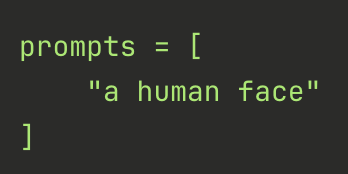

# Lab-3 : NanoOwl Vision Transformer

## ⚠️ IMPORTANT SETUP INSTRUCTIONS

**Please DO NOT use Headless Mode** as it creates compatibility issues with display forwarding and GUI applications.

### Before Starting the Lab:

1. **Connect all peripherals to your Jetson Orin Nano:**
   - Power cable
   - DisplayPort (DP) cable
   - Ethernet cable
   - Keyboard & Mouse
   - USB Webcam

2. **Set Jetson to Maximum Power Mode:**
   - Click the **power icon** in the **top-right corner** of the desktop
   - Select **MAXN SUPER** power mode
   - This ensures maximum performance for model training and inference

**Power Mode Menu Reference:**


> **Note:** These setup steps are crucial for proper operation of OpenCV GUI windows, webcam access, and optimal performance during training.

---

## Step 1: System Update

Open a terminal and run the following commands to update the system:
```bash
sudo apt update
sudo apt upgrade
```

When prompted, enter the machine password:
```
machinelearning<kit#>
```

Once the update is done, please restart your Jetson.

> **Note:** The upgrade step may take a few minutes depending on the number of packages to update. Wait for it to complete fully before proceeding.
---

## Step 2: Pull the Docker Image

Run the following command to pull the NanoOWL Docker image:
```bash
sudo docker pull dustynv/nanoowl:r36.4.0
```

> **Note:** This is a large image (~6GB) and will take several minutes depending on your network speed. Wait for it to complete fully before proceeding.

---

## Step 3: Run the Docker Container

First, create the output directory on your host machine:
```bash
mkdir -p /home/$USER/nanoowl_outputs
```

Then run the Docker container:
```bash
sudo docker run -it --rm \
  --runtime nvidia \
  --device /dev/video0 \
  --network host \
  -v /tmp/.X11-unix:/tmp/.X11-unix \
  -e DISPLAY=$DISPLAY \
  -v /home/$USER/nanoowl_outputs:/outputs \
  --workdir /opt/nanoowl/examples/tree_demo \
  dustynv/nanoowl:r36.4.0 \
  /bin/bash
```

You will know you are inside the container when your terminal prompt changes to:
```
root@ubuntu:/opt/nanoowl/examples/tree_demo#
```

> **Note:** The `/outputs` folder is shared between the container and your host machine. Any files saved to `/outputs` inside the container will be accessible on your desktop at `/home/$USER/nanoowl_outputs`.

---

## Step 4: Install Required Module

Once inside the container, install the `aiohttp` module:
```bash
pip install --no-cache-dir \
  --index-url https://pypi.org/simple \
  --extra-index-url https://pypi.jetson-ai-lab.io/jp6/cu126 \
  aiohttp
```

> **Note:** This installs `aiohttp` which is required for the web server that streams the detection output to your browser. And everytime you exit the docker make sure to reinstall this module. It is a very small module so should be over within 1 minute.

---

## Step 5: Set Up Model Cache Directory

Run the following commands to set up the cache directory for the ViT model:
```bash
rm /root/.cache/clip
mkdir -p /root/.cache/clip
```

> **Note:** The first command removes an incorrectly created file that conflicts with the model cache, and the second creates a proper directory in its place. This is required for the model weights to download and store correctly.

---

## Step 6: Run the NanoOWL Tree Demo

Run the following command to start the ViT detection server:
```bash
python3 tree_demo.py ../../data/owl_image_encoder_patch32.engine
```

You will know the server is running successfully when you see a URL in the terminal like:
```
======== Running on http://0.0.0.0:7860 ========
```

Hold `Ctrl` and click the link to open it in your browser.


NanoOWL is a project that optimizes **OWL-ViT** to run 🔥 real-time 🔥 on **NVIDIA Jetson Orin Platforms** with **NVIDIA TensorRT**. NanoOWL also introduces a new "tree detection" pipeline that combines OWL-ViT and CLIP to enable nested detection and classification of anything, at any level, simply by providing text.

Type whatever prompt you like to see what works! Here are some examples:
* Example: `[a face [a nose, an eye, a mouth]]`
* Example: `[a face (interested, yawning / bored)]`
* Example: `(indoors, outdoors)`

> **Note:** If the webcam feed is not displayed, reload the browser and it should appear.

---

## Lab-3 TODOs

In this lab you will move beyond simply running the model — you will **interrogate it**. Using NanoOWL and the attention visualization script, you will conduct a series of structured experiments designed to reveal how the model thinks, where it succeeds, and critically, where it fails.

The underlying goal is to develop intuition for how Vision Transformers differ from CNNs — not by reading about it, but by observing it directly through the model's behavior under controlled conditions. By the end of the lab you should be able to explain *why* OWL-ViT responds the way it does to different prompts, lighting conditions, and scene compositions, grounded in what you know about its architecture.

---

### Part 1 — Setup & Baseline

Before running any experiments, you need to establish a baseline. This gives you a reference point to compare against in all subsequent parts.

**Step 1:** Make sure the tree_demo server is running and open in your browser. Point the webcam at yourself and type the following prompt:
```
[a face]
```

Record the following in your lab notebook:
- Detection score displayed on the bounding box
- Which region of the image the box covers

After that, close the browser, go back to your terminal and press `Ctrl + C` to stop the code. 

**Step 2:** Now we will run the attention heatmap script to visualize what the model is focusing on. Copy the following code:
```python
import torch
import numpy as np
import matplotlib
matplotlib.use('Agg')
import matplotlib.pyplot as plt
from transformers import OwlViTProcessor, OwlViTForObjectDetection
from PIL import Image
import cv2

CAMERA_DEVICE = 0

camera = cv2.VideoCapture(CAMERA_DEVICE)
camera.set(cv2.CAP_PROP_FRAME_WIDTH, 640)
camera.set(cv2.CAP_PROP_FRAME_HEIGHT, 480)

if not camera.isOpened():
    raise RuntimeError("Could not open camera")

print("Camera opened. Press ENTER to capture...")
input()

re, frame = camera.read()
if not re:
    raise RuntimeError("Failed to read frame")

camera.release()
print("Frame captured.")

cv2.imwrite("captured_frame.jpg", frame)
image = Image.fromarray(cv2.cvtColor(frame, cv2.COLOR_BGR2RGB))
img_np = np.array(image)
img_w, img_h = image.size

print("Loading model...")
processor = OwlViTProcessor.from_pretrained("google/owlvit-base-patch32")
model = OwlViTForObjectDetection.from_pretrained("google/owlvit-base-patch32")
model.eval()

prompts = [
    "a human face"
]

def run_prompt(prompt):
    inputs = processor(text=[[prompt]], images=image, return_tensors="pt")
    with torch.no_grad():
        outputs = model(**inputs, output_attentions=True)

    logits = torch.sigmoid(outputs.logits[0, :, 0])
    boxes = outputs.pred_boxes[0]
    best_idx = logits.argmax().item()
    best_score = logits[best_idx].item()
    best_box = boxes[best_idx].detach().numpy()

    cx, cy, w, h = best_box
    x1 = int((cx - w / 2) * img_w)
    y1 = int((cy - h / 2) * img_h)
    x2 = int((cx + w / 2) * img_w)
    y2 = int((cy + h / 2) * img_h)

    similarity = torch.sigmoid(outputs.logits[0, :, 0]).detach().numpy()
    p_low, p_high = np.percentile(similarity, 10), np.percentile(similarity, 99)
    similarity = np.clip((similarity - p_low) / (p_high - p_low + 1e-6), 0, 1)
    num_patches = int(similarity.shape[0] ** 0.5)
    attn_map = similarity.reshape(num_patches, num_patches)

    attn_resized = cv2.resize(attn_map, (img_w, img_h))
    heatmap = cv2.applyColorMap((attn_resized * 255).astype(np.uint8), cv2.COLORMAP_JET)
    heatmap_rgb = cv2.cvtColor(heatmap, cv2.COLOR_BGR2RGB)
    overlay = (0.5 * img_np + 0.5 * heatmap_rgb).astype(np.uint8)

    cv2.rectangle(overlay, (x1, y1), (x2, y2), (0, 255, 0), 2)
    cv2.putText(overlay, f"{best_score:.2f}", (x1, max(y1 - 10, 0)),
                cv2.FONT_HERSHEY_SIMPLEX, 0.6, (0, 255, 0), 2)

    return attn_map, overlay, best_score

fig, axes = plt.subplots(1, 3, figsize=(15, 5))

for i, prompt in enumerate(prompts):
    print(f"Running prompt: '{prompt}'...")
    attn_map, overlay, score = run_prompt(prompt)

    axes[0].imshow(img_np)
    axes[0].set_title("Captured Image")
    axes[0].axis("off")

    axes[1].imshow(attn_map, cmap="hot")
    axes[1].set_title("Per-Patch Score")
    axes[1].axis("off")

    axes[2].imshow(overlay)
    axes[2].set_title("Detection + Heatmap")
    axes[2].axis("off")

plt.tight_layout()
plt.savefig("attention_output.png", dpi=150)
print("Saved to attention_output.png")
```

In your Docker terminal, open the nano text editor:
```bash
nano attention_heatmap.py
```

Right-click inside the editor and select **Paste** to paste the code. Note that `Ctrl+C` and `Ctrl+V` do not work inside nano.

Once pasted, press `Ctrl+X` to exit. When prompted to save, press `Y`. You will be returned to the Docker terminal.

Verify the file was created by running:
```bash
ls
```

You should see `attention_heatmap.py` in the list. Then run the script:
```bash
python3 attention_heatmap.py
```

Point the webcam towards your face. Once you are satisfied with the angle, press `Enter` to capture the image. The model will then process it — you will know it is done when you see:
```
Saved to attention_output.png
```

Open a **new terminal** (do not close the existing one) and run:
```bash
sudo docker cp $(sudo docker ps -q):/opt/nanoowl/examples/tree_demo/attention_output.png ~/
```

This transfers the output image to your Jetson home directory where you can open and view the heatmap overlaid on your captured image.

**Step 3:** Fill in the baseline row of your results table:

| Prompt | Detection Score | Box Location | Heatmap Concentration |
|---|---|---|---|
| a human face | | | |

**Step 4:** Repeat Steps 1 and 2 for 4 more different objects present near you (e.g., a laptop, a water bottle, a chair, a backpack).

For each object, you will need to update the `prompts` section of `attention_heatmap.py`. Open the file in nano:
```bash
nano attention_heatmap.py
```

Scroll down to the prompts section and replace `"a human face"` with the object you want to detect:



Save the file with `Ctrl+X`, then `Y`. Run the script again:
```bash
python3 attention_heatmap.py
```

Once you see `Saved to attention_output.png`, export the image to your home folder from the second terminal:
```bash
sudo docker cp $(sudo docker ps -q):/opt/nanoowl/examples/tree_demo/attention_output.png ~/
```

> **Note:** Rename each exported image before running the next experiment, otherwise it will be overwritten. For example:
> ```bash
> mv ~/attention_output.png ~/attention_laptop.png
> ```

Add a new row to your results table for each object. In total there will be 5 entries after completion of Part-1.

---

### Part 2 — Prompt Engineering Experiments

In this part you will run systematic experiments by varying the text prompt and observing how the model responds. For each experiment, update the `prompts` section of `attention_heatmap.py`, run the script, export the output, and record your results in the tables below.

---

#### Experiment A: Specificity Ladder

Run the same scene through increasingly specific prompts. Keep the webcam pointed at your face for all 5 runs.

| Prompt | Detection Score | Box Location | Heatmap Concentration |
|---|---|---|---|
| "an object" | | | |
| "a person" | | | |
| "a face" | | | |
| "a human face with glasses" | | | |
| "a male face with glasses and a beard" | | | |

**Question:** As the prompt becomes more specific, does the detection score go up or down? Does the heatmap shift? Write 2-3 sentences explaining what you observe.

---

#### Experiment B: Wrong Prompts

Keep the webcam pointed at your face but deliberately use incorrect prompts — objects that are not present in the scene.

| Prompt | Detection Score | Box Location (correct / incorrect / none) | Heatmap Concentration |
|---|---|---|---|
| "a dog" | | | |
| "a car" | | | |
| "a chair" | | | |

**Question:** Does the model still return a bounding box even when the prompt is completely wrong? Where does it land and what does the heatmap look like? What does this tell you about how the model handles uncertainty?

---

#### Experiment C: Adversarial Prompts

These prompts are designed to conflict with what is actually in the scene. Keep the webcam pointed at your face.

| Prompt | Detection Score | Box Location | Heatmap Concentration |
|---|---|---|---|
| "a face but not wearing glasses" | | | |
| "a happy face" | | | |
| "a sad face" | | | |

> **Note:** For the happy vs sad comparison, keep the same neutral expression for both runs so the only variable is the prompt.

**Question:** Does the score change between "a happy face" and "a sad face" on the same neutral expression? Does the heatmap shift between the two? What does this reveal about how the text encoder interprets emotional attributes?

Repeat these experiments for each of the 5 entries from Part-1. The example is shown here for your first entry 'a face'. You have to design and change the prompts for the next 4 entries. At the end of Part-2 you should have Two different tables, Table-1 from Part-1 consisting of 5 entries and Table-2 from Part-2 consisting of 55 entries (11 for each).

---

### Part 3 — Tree Prompt Design & Failure Mode Documentation

This part has two connected activities. First you will design a hierarchical tree prompt to describe a complex scene, then you will deliberately stress-test the model to document where and why it fails.

---

#### Activity A: Tree Prompt Design

Using the tree_demo browser interface, your task is:

> *"Build a tree prompt that can describe a person sitting at a desk in enough detail that someone who couldn't see the image could reconstruct the scene."*

You are expected to iterate — start simple and progressively refine your tree until you are satisfied with the level of detail the model can detect. Here is an example progression to get you started:
```
[a person]                                                          # too simple
[a person, [sitting, standing]]                                     # adds pose
[a person, [sitting, standing], [a desk, a chair, a laptop]]        # adds context
```

For each iteration, record your tree prompt string and take a screenshot of the browser output. You will need at least **3 iterations** showing your refinement process.

| Iteration | Tree Prompt String | What was detected | What was missed |
|---|---|---|---|
| 1 | | | |
| 2 | | | |
| 3 | | | |

**Deliverable:** Your final tree prompt string + a screenshot of the browser output + a short paragraph explaining why you structured the tree the way you did and what you would change if you had more time.

---

#### Activity B: Failure Mode Documentation

Now deliberately try to break the model using `attention_heatmap.py`. For each test, update the prompt to `"a human face"`, run the script, export the image, and record your observations.

| Test | Condition | Detection Score | Box Location | Hypothesis for why it failed |
|---|---|---|---|---|
| Occlusion | Cover half your face with your hand | | | |
| Lighting | Point phone flashlight directly at camera | | | |
| Lighting | Dim the room lights as much as possible | | | |
| Distance | Sit as close as possible to the camera | | | |
| Distance | Sit at medium distance (~1m) | | | |
| Distance | Sit far from the camera (~3m) | | | |
| Multi-person | Two students in frame | | | |
| Rotation | Tilt head 45 degrees | | | |
| Rotation | Tilt head 90 degrees | | | |

**Question 1:** At what distance did the score drop below 0.5? Did the heatmap change before the score dropped?

**Question 2:** Which failure surprised you the most and why?

**Question 3:** For any two tests above, predict how a CNN-based detector like YOLOv8 would behave differently under the same condition, based on what you know about how CNNs build their representations compared to ViT.


---

## Lab Report Deliverables

Your lab report must be submitted as a single PDF by **March 6, 2026**. It should contain the following sections in order:

---

### Section 1 — Baseline & Object Detection (Part 1)

**Table 1:** Results for 5 objects including your face and 4 objects from your surroundings.

| # | Prompt | Detection Score | Box Location | Heatmap Concentration |
|---|---|---|---|---|
| 1 | a human face | | | |
| 2 | | | | |
| 3 | | | | |
| 4 | | | | |
| 5 | | | | |

**Images:** Include the exported `attention_output.png` for each of the 5 entries. Label each image clearly with the prompt used.

---

### Section 2 — Prompt Engineering Experiments (Part 2)

**Table 2:** Results for all 5 objects across all 3 experiments (Specificity Ladder, Wrong Prompts, Adversarial Prompts) — 11 rows per object, 55 rows total.

| # | Object | Experiment | Prompt | Detection Score | Box Location | Heatmap Concentration |
|---|---|---|---|---|---|---|
| 1 | face | Specificity | "an object" | | | |
| 2 | face | Specificity | "a person" | | | |
| 3 | face | Specificity | "a face" | | | |
| 4 | face | Specificity | "a human face with glasses" | | | |
| 5 | face | Specificity | "a male face with glasses and a beard" | | | |
| 6 | face | Wrong | "a dog" | | | |
| 7 | face | Wrong | "a car" | | | |
| 8 | face | Wrong | "a chair" | | | |
| 9 | face | Adversarial | "a face but not wearing glasses" | | | |
| 10 | face | Adversarial | "a happy face" | | | |
| 11 | face | Adversarial | "a sad face" | | | |
| ... | object 2 | ... | ... | | | |

**Images:** Include at least one representative `attention_output.png` per experiment per object (minimum 15 images).

**Written Answers:** Answer the following questions based on your Table 2 results:

1. As the prompt becomes more specific, does the detection score go up or down? Does the heatmap shift? *(2-3 sentences)*
2. Does the model still return a bounding box when the prompt is completely wrong? What does this tell you about how the model handles uncertainty? *(2-3 sentences)*
3. Does the score change between "a happy face" and "a sad face" on the same neutral expression? What does this reveal about how the text encoder interprets emotional attributes? *(2-3 sentences)*

---

### Section 3 — Tree Prompt Design & Failure Mode Documentation (Part 3)

**Table 3A — Tree Prompt Iterations:**

| Iteration | Tree Prompt String | What was detected | What was missed |
|---|---|---|---|
| 1 | | | |
| 2 | | | |
| 3 | | | |

**Deliverables for Activity A:**
- Screenshot of your final tree prompt output in the browser
- A short paragraph (5-7 sentences) explaining why you structured the tree the way you did and what you would change if you had more time

**Table 3B — Failure Mode Results:**

| Test | Condition | Detection Score | Box Location | Hypothesis for why it failed |
|---|---|---|---|---|
| Occlusion | Cover half your face with your hand | | | |
| Lighting | Phone flashlight directly at camera | | | |
| Lighting | Dim the room lights | | | |
| Distance | As close as possible | | | |
| Distance | ~1m away | | | |
| Distance | ~3m away | | | |
| Multi-person | Two students in frame | | | |
| Rotation | 45 degrees | | | |
| Rotation | 90 degrees | | | |

**Images:** Include the exported `attention_output.png` for each failure mode test (9 images).

**Written Answers:**

1. At what distance did the score drop below 0.5? Did the heatmap change before the score dropped? *(2-3 sentences)*
2. Which failure surprised you the most and why? *(2-3 sentences)*
3. For any two failure tests, predict how YOLOv8 would behave differently under the same condition based on what you know about CNN vs ViT architectures. *(4-5 sentences)*

---

## Lab Report Deadline : 6 March 2026
