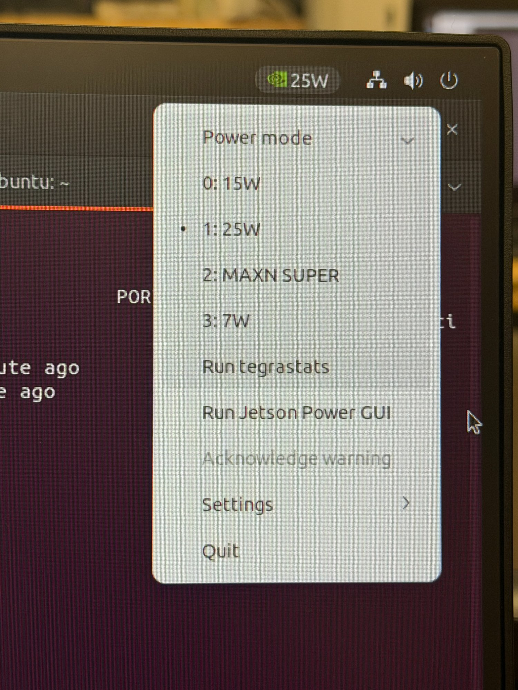

# Lab-4 : Denoising Diffusion Probabilistic Models (DDPM)

## ⚠️ IMPORTANT SETUP INSTRUCTIONS

**Please DO NOT use Headless Mode** as it creates compatibility issues with display forwarding and GUI applications.

### Before Starting the Lab:

1. **Connect all peripherals to your Jetson Orin Nano:**
   - Power cable
   - DisplayPort (DP) cable
   - Ethernet cable
   - Keyboard & Mouse

2. **Set Jetson to Maximum Power Mode:**
   - Click the **power icon** in the **top-right corner** of the desktop
   - Select **MAXN SUPER** power mode
   - This ensures maximum performance for model training and inference

**Power Mode Menu Reference:**



> **Note:** These setup steps are crucial for optimal performance during training and inference.

---

## Step 1: System Update

Open a terminal and run the following commands to update the system:
```bash
sudo apt update
sudo apt upgrade
```

When prompted, enter the machine password:
```
machinelearning<kit#>
```

Once the update is done, please restart your Jetson.

> **Note:** The upgrade step may take a few minutes depending on the number of packages to update. Wait for it to complete fully before proceeding.

---

## Step 2: Setting Up Jetson Containers

Open a terminal and navigate to the Documents folder:
```bash
cd Documents
```

Clone the jetson-containers repository and run the install script:
```bash
git clone https://github.com/dusty-nv/jetson-containers
bash jetson-containers/install.sh
```

Once installed, pull and run the container:
```bash
jetson-containers run dustynv/l4t-pytorch:r36.4.0
```

You will know you are inside the container when your terminal prompt changes to:
```
root@l4t-pytorch
```

---

## Step 3: Install Required Modules

Once inside the container, install the required Python packages:
```bash
pip3 install diffusers accelerate matplotlib --index-url https://pypi.jetson-ai-lab.io/jp6/cu126
```

> **Note:** This installs the necessary packages for running DDPM inference and training. Wait for the installation to complete before proceeding.

---

## 📺 Recommended Video — Watch During the Lab

Parts C, D, E, and F involve long-running computations that will keep the Jetson busy for extended periods. While the code is executing, watch the video below to build a conceptual understanding of DDPM — the forward process, the reverse process, the UNet's role, and the noise schedule. This will directly help you answer the lab report questions.

**Diffusion Models: DDPM Explained — Deepia**
[https://youtu.be/EhndHhIvWWw?si=PkWspdWzieyIJYd1](https://youtu.be/EhndHhIvWWw?si=PkWspdWzieyIJYd1)

> **Tip:** You do not need to watch this before starting. Start the lab, kick off a long-running part, then watch the video while the Jetson computes.

---

## Step 4: Part A — Environment Setup & Baseline

Open the nano text editor inside the container:
```bash
nano lab4_partA.py
```

Right-click inside the editor and select **Paste** to paste the code below. Note that `Ctrl+C` and `Ctrl+V` do not work inside nano.

```python
import torch
import time
import os
from diffusers import DDPMPipeline

OUTPUT_DIR = "./lab4_outputs"
os.makedirs(OUTPUT_DIR, exist_ok=True)

MODEL_ID = "google/ddpm-celebahq-256"
DEVICE   = "cuda" if torch.cuda.is_available() else "cpu"

print("=" * 60)
print("  TASK A1: Environment Check")
print("=" * 60)

print(f"\n  PyTorch version   : {torch.__version__}")
print(f"  CUDA available    : {torch.cuda.is_available()}")

if torch.cuda.is_available():
    props = torch.cuda.get_device_properties(0)
    print(f"  GPU               : {props.name}")
    print(f"  Total VRAM (GB)   : {props.total_memory / 1e9:.2f}")
    print(f"  CUDA version      : {torch.version.cuda}")
else:
    print("  No GPU found — running on CPU (will be slow)")

print("\n" + "=" * 60)
print("  TASK A2: Load Pre-trained DDPM Model")
print("=" * 60)

print(f"\n  Loading {MODEL_ID} ...")
t0 = time.time()
pipeline = DDPMPipeline.from_pretrained(MODEL_ID)
pipeline = pipeline.to(DEVICE)
load_time = time.time() - t0

vram_after_load = torch.cuda.memory_allocated() / 1e9 if torch.cuda.is_available() else 0

print(f"  Model loaded successfully")
print(f"  Load time (s)     : {load_time:.2f}")
print(f"  VRAM after load   : {vram_after_load:.3f} GB")

print("\n" + "=" * 60)
print("  TASK A3: Generate Your First Image")
print("=" * 60)

# ── MODIFY THIS VALUE ──────────────────────────────────────────────────────
num_steps = 200    # Try: 50, 100, 200 — observe how quality and speed change
# ──────────────────────────────────────────────────────────────────────────

print(f"\n  Generating image with {num_steps} inference steps ...")
t0 = time.time()
with torch.no_grad():
    output = pipeline(batch_size=1, num_inference_steps=num_steps)
gen_time = time.time() - t0

image = output.images[0]
save_path = os.path.join(OUTPUT_DIR, "partA_first_image.png")
image.save(save_path)

vram_during_gen = torch.cuda.memory_allocated() / 1e9 if torch.cuda.is_available() else 0

print(f"  Image saved: {save_path}")
print(f"  Generation time   : {gen_time:.2f}s")
print(f"  Steps/sec         : {num_steps / gen_time:.1f}")
print(f"  VRAM during gen   : {vram_during_gen:.3f} GB")

gpu_name   = torch.cuda.get_device_name(0) if torch.cuda.is_available() else "CPU"
total_vram = torch.cuda.get_device_properties(0).total_memory / 1e9 if torch.cuda.is_available() else 0

print(f"""
  ┌──────────────────────┬──────────────────────────┐
  │ Metric               │ Value                    │
  ├──────────────────────┼──────────────────────────┤
  │ GPU                  │ {gpu_name:<24s} │
  │ Total VRAM (GB)      │ {total_vram:<24.2f} │
  │ Model load time (s)  │ {load_time:<24.2f} │
  │ VRAM after load (GB) │ {vram_after_load:<24.3f} │
  │ Inference steps      │ {num_steps:<24d} │
  │ Generation time (s)  │ {gen_time:<24.2f} │
  │ Steps/sec            │ {num_steps/gen_time:<24.1f} │
  │ VRAM during gen (GB) │ {vram_during_gen:<24.3f} │
  └──────────────────────┴──────────────────────────┘
""")
```

Once pasted, press `Ctrl+X` to exit. When prompted to save, press `Y`, then press `Enter` to confirm the filename. You will be returned to the container terminal.

Verify the file was created:
```bash
ls
```

You should see `lab4_partA.py` in the list. 

Before running, open the file in nano and modify the `num_steps` value:
```bash
nano lab4_partA.py
```

Scroll down to the line that says `# ── MODIFY THIS VALUE ──` and change `num_steps` to your chosen value. Run the script **3 times** with different values (e.g. `50`, `100`, `200`) and record the results each time. Save and exit with `Ctrl+X`, then `Y`, then `Enter` after each edit.

Then run the script:
```bash
python3 lab4_partA.py
```

You will know it is complete when you see the results table printed in the terminal and the following message:
```
✅ Part A complete.
```

To view the generated image, open a **new terminal** on the host and run:
```bash
docker cp $(docker ps -q):/lab4_outputs/partA_first_image.png ~/
```

---

### Lab Report Deliverables — Part A

- **Screenshot** of terminal output for each of the 3 runs
- **partA_first_image.png** — your first DDPM generated face image

Run the script 3 times with different `num_steps` values and fill in the table:

| num_steps | Generation time (s) | Steps/sec | VRAM during gen (GB) | Observation |
|---|---|---|---|---|
| 50 | | | | |
| 100 | | | | |
| 200 | | | | |

**Question:** As `num_steps` increases, what happens to image quality and generation time? Is the relationship linear?

**Question:** Run the script twice with the same `num_steps` value. Is the generated face the same both times? Why or why not?

---

## Step 5: Part B — Forward Diffusion Visualization

Open the nano text editor inside the container:
```bash
nano lab4_partB.py
```

Right-click inside the editor and select **Paste** to paste the code below. Note that `Ctrl+C` and `Ctrl+V` do not work inside nano.

```python
import torch
import numpy as np
import matplotlib.pyplot as plt
import os
from PIL import Image
from diffusers import DDPMScheduler
import torchvision.transforms as T

OUTPUT_DIR = "./lab4_outputs"
os.makedirs(OUTPUT_DIR, exist_ok=True)

DEVICE = "cuda" if torch.cuda.is_available() else "cpu"

def load_sample_image():
    if os.path.exists("./lab4_outputs/partA_first_image.png"):
        img = Image.open("./lab4_outputs/partA_first_image.png").convert("RGB").resize((256, 256))
        print("  Loaded: partA_first_image.png")
    else:
        arr = np.zeros((256, 256, 3), dtype=np.uint8)
        for i in range(256):
            arr[i, :, 0] = int(255 * i / 255)
            arr[:, i, 2] = int(255 * (255 - i) / 255)
        arr[:, :, 1] = 128
        img = Image.fromarray(arr)
        print("  partA_first_image.png not found — using generated gradient image.")
    return img

def image_to_tensor(pil_img):
    tensor = T.ToTensor()(pil_img).unsqueeze(0).to(DEVICE)
    return tensor * 2 - 1

def tensor_to_pil(tensor):
    arr = tensor.squeeze().permute(1, 2, 0).cpu().numpy()
    arr = ((arr + 1) / 2 * 255).clip(0, 255).astype(np.uint8)
    return Image.fromarray(arr)

def make_scheduler(beta_schedule="linear", beta_start=0.0001, beta_end=0.02):
    return DDPMScheduler(
        num_train_timesteps=1000,
        beta_schedule=beta_schedule,
        beta_start=beta_start,
        beta_end=beta_end,
    )

print("=" * 60)
print("  Loading sample image ...")
print("=" * 60)
image = load_sample_image()
image_tensor = image_to_tensor(image)

# ── TASK B1 ────────────────────────────────────────────────────────────────
# ── MODIFY THESE VALUES ────────────────────────────────────────────────────
timesteps_to_viz = [0, 100, 250, 500, 750, 999]
beta_schedule    = "linear"    # try: "squaredcos_cap_v2"
beta_start       = 0.0001
beta_end         = 0.02
# ──────────────────────────────────────────────────────────────────────────

scheduler = make_scheduler(beta_schedule, beta_start, beta_end)

fig, axes = plt.subplots(1, len(timesteps_to_viz), figsize=(3 * len(timesteps_to_viz), 3.5))
for ax, t in zip(axes, timesteps_to_viz):
    noise = torch.randn_like(image_tensor)
    noisy = scheduler.add_noise(image_tensor, noise, torch.tensor([t], device=DEVICE))
    ax.imshow(tensor_to_pil(noisy))
    ax.set_title(f"t = {t}", fontsize=10)
    ax.axis("off")

plt.suptitle(f"Forward Diffusion  |  schedule={beta_schedule}, beta_start={beta_start}, beta_end={beta_end}", fontsize=11)
plt.tight_layout()
plt.savefig(os.path.join(OUTPUT_DIR, "partB1_forward_diffusion.png"), bbox_inches="tight", dpi=120)
plt.close()
print("  Saved: partB1_forward_diffusion.png")

# ── TASK B2 ────────────────────────────────────────────────────────────────
# ── MODIFY THESE VALUES ────────────────────────────────────────────────────
schedules = ["linear", "squaredcos_cap_v2"]
compare_t = 500
# ──────────────────────────────────────────────────────────────────────────

fig, axes = plt.subplots(1, len(schedules), figsize=(6, 3.5))
for ax, sched in zip(axes, schedules):
    s = make_scheduler(sched)
    noise = torch.randn_like(image_tensor)
    noisy = s.add_noise(image_tensor, noise, torch.tensor([compare_t], device=DEVICE))
    ax.imshow(tensor_to_pil(noisy))
    ax.set_title(sched, fontsize=10)
    ax.axis("off")

plt.suptitle(f"Noise Schedule Comparison at t={compare_t}", fontsize=11)
plt.tight_layout()
plt.savefig(os.path.join(OUTPUT_DIR, "partB2_schedule_comparison.png"), bbox_inches="tight", dpi=120)
plt.close()
print("  Saved: partB2_schedule_comparison.png")

# ── TASK B3 ────────────────────────────────────────────────────────────────
# ── MODIFY THESE VALUES ────────────────────────────────────────────────────
beta_end_values = [0.005, 0.02, 0.05, 0.1]
fixed_t         = 300
# ──────────────────────────────────────────────────────────────────────────

fig, axes = plt.subplots(1, len(beta_end_values), figsize=(3 * len(beta_end_values), 3.5))
for ax, be in zip(axes, beta_end_values):
    s = make_scheduler("linear", beta_start=0.0001, beta_end=be)
    noise = torch.randn_like(image_tensor)
    noisy = s.add_noise(image_tensor, noise, torch.tensor([fixed_t], device=DEVICE))
    ax.imshow(tensor_to_pil(noisy))
    ax.set_title(f"beta_end = {be}", fontsize=10)
    ax.axis("off")

plt.suptitle(f"Beta End Sensitivity  |  t={fixed_t}, schedule=linear", fontsize=11)
plt.tight_layout()
plt.savefig(os.path.join(OUTPUT_DIR, "partB3_beta_sensitivity.png"), bbox_inches="tight", dpi=120)
plt.close()
print("  Saved: partB3_beta_sensitivity.png")
print("  Part B complete.")
```

Once pasted, press `Ctrl+X` to exit. When prompted to save, press `Y`, then press `Enter` to confirm the filename. You will be returned to the container terminal.

Verify the file was created:
```bash
ls
```

You should see `lab4_partB.py` in the list.

Before running, open the file and modify the values marked `# ── MODIFY THESE VALUES ──`:
```bash
nano lab4_partB.py
```

The modifiable parameters are:

- **B1:** `timesteps_to_viz`, `beta_schedule`, `beta_start`, `beta_end`
- **B2:** `schedules`, `compare_t`
- **B3:** `beta_end_values`, `fixed_t`

Save and exit with `Ctrl+X`, then `Y`, then `Enter`. Then run the script:
```bash
python3 lab4_partB.py
```

You will know it is complete when you see:
```
  Part B complete.
```

To copy the output images to your host machine, open a **new terminal** and run:
```bash
docker cp $(docker ps -q):/lab4_outputs/partB1_forward_diffusion.png ~/
docker cp $(docker ps -q):/lab4_outputs/partB2_schedule_comparison.png ~/
docker cp $(docker ps -q):/lab4_outputs/partB3_beta_sensitivity.png ~/
```

---

### Lab Report Deliverables — Part B

- **partB1_forward_diffusion.png** — 6-panel strip showing image destruction from t=0 to t=999
- **partB2_schedule_comparison.png** — linear vs cosine schedule side by side at t=500
- **partB3_beta_sensitivity.png** — 4-panel grid showing effect of different beta_end values at t=300

| Question | Your Answer |
|---|---|
| At what timestep does the image become completely unrecognizable? | |
| Which schedule (linear/cosine) preserves image structure longer? | |
| At t=300, how does doubling beta_end affect the image? | |

---

## Step 6: Part C — UNet Inspection

Open the nano text editor inside the container:
```bash
nano lab4_partC.py
```

Right-click inside the editor and select **Paste** to paste the code below. Note that `Ctrl+C` and `Ctrl+V` do not work inside nano.

```python
import torch
import numpy as np
import matplotlib.pyplot as plt
import os
from PIL import Image
from diffusers import DDPMPipeline, DDPMScheduler
import torchvision.transforms as T
import urllib.request

OUTPUT_DIR = "./lab4_outputs"
os.makedirs(OUTPUT_DIR, exist_ok=True)

MODEL_ID = "google/ddpm-celebahq-256"
DEVICE   = "cuda" if torch.cuda.is_available() else "cpu"

def load_sample_image():
    save_path = os.path.join(OUTPUT_DIR, "sample_face.png")
    if not os.path.exists(save_path):
        print("  Downloading sample image ...")
        url = "https://ultralytics.com/images/bus.jpg"
        urllib.request.urlretrieve(url, save_path)
        print(f"  Downloaded: {save_path}")
    else:
        print(f"  Using cached: {save_path}")
    img = Image.open(save_path).convert("RGB").resize((256, 256))
    return img

def image_to_tensor(pil_img):
    tensor = T.ToTensor()(pil_img).unsqueeze(0).to(DEVICE)
    return tensor * 2 - 1

def tensor_to_pil(tensor):
    arr = tensor.squeeze().permute(1, 2, 0).cpu().numpy()
    arr = ((arr + 1) / 2 * 255).clip(0, 255).astype(np.uint8)
    return Image.fromarray(arr)

def noise_to_pil(tensor):
    arr = tensor.squeeze().permute(1, 2, 0).cpu().numpy()
    arr = (arr - arr.min()) / (arr.max() - arr.min() + 1e-8)
    return Image.fromarray((arr * 255).astype(np.uint8))

print("=" * 60)
print("  Loading DDPM model ...")
print("=" * 60)
pipeline     = DDPMPipeline.from_pretrained(MODEL_ID).to(DEVICE)
unet         = pipeline.unet
scheduler    = pipeline.scheduler
image        = load_sample_image()
image_tensor = image_to_tensor(image)

# ── TASK C1 ────────────────────────────────────────────────────────────────
total_params     = sum(p.numel() for p in unet.parameters())
trainable_params = sum(p.numel() for p in unet.parameters() if p.requires_grad)

print(f"  UNet class            : {unet.__class__.__name__}")
print(f"  Total parameters      : {total_params:,}")
print(f"  Trainable parameters  : {trainable_params:,}")
print(f"  Input channels        : {unet.config.in_channels}")
print(f"  Output channels       : {unet.config.out_channels}")
print(f"  Image size            : {unet.config.sample_size}x{unet.config.sample_size}")
print(f"  Block channels        : {unet.config.block_out_channels}")
print(f"  Layers per block      : {unet.config.layers_per_block}")
print(f"  Down block types      : {list(unet.config.down_block_types)}")
print(f"  Up block types        : {list(unet.config.up_block_types)}")

# ── TASK C2 ────────────────────────────────────────────────────────────────
# ── MODIFY THIS VALUE ──────────────────────────────────────────────────────
chosen_t = 500    # try: 100, 250, 500, 750, 999
# ──────────────────────────────────────────────────────────────────────────

noise     = torch.randn_like(image_tensor)
t_tensor  = torch.tensor([chosen_t], device=DEVICE)
noisy_img = scheduler.add_noise(image_tensor, noise, t_tensor)

print(f"\n  Timestep chosen       : {chosen_t}")
print(f"  Input shape           : {noisy_img.shape}")
print(f"  Timestep tensor shape : {t_tensor.shape}")

with torch.no_grad():
    unet_output = unet(noisy_img, t_tensor)

predicted_noise = unet_output.sample
print(f"  Output shape          : {predicted_noise.shape}")
print(f"  Actual noise range    : [{noise.min():.3f}, {noise.max():.3f}]")
print(f"  Predicted noise range : [{predicted_noise.min():.3f}, {predicted_noise.max():.3f}]")

mse_c2 = torch.nn.functional.mse_loss(predicted_noise, noise).item()
print(f"  MSE (pred vs actual)  : {mse_c2:.4f}")

# ── TASK C3 ────────────────────────────────────────────────────────────────
# ── MODIFY THIS VALUE ──────────────────────────────────────────────────────
viz_timesteps = [0, 100, 200, 300, 400, 500, 600, 700, 800, 999]
# ──────────────────────────────────────────────────────────────────────────

print(f"  Running {len(viz_timesteps)} forward passes for visualization ...")
fig, axes = plt.subplots(len(viz_timesteps), 4, figsize=(14, 3.5 * len(viz_timesteps)))

for row, t_val in enumerate(viz_timesteps):
    noise_v = torch.randn_like(image_tensor)
    t_v     = torch.tensor([t_val], device=DEVICE)
    noisy_v = scheduler.add_noise(image_tensor, noise_v, t_v)
    with torch.no_grad():
        pred_v = unet(noisy_v, t_v).sample
    mse_v = torch.nn.functional.mse_loss(pred_v, noise_v).item()

    panels = [
        (image,                 "Original"),
        (tensor_to_pil(noisy_v), f"Noisy (t={t_val})"),
        (noise_to_pil(pred_v),  "Predicted noise"),
        (noise_to_pil(noise_v), "Actual noise"),
    ]
    for col, (img, title) in enumerate(panels):
        axes[row, col].imshow(img)
        axes[row, col].axis("off")
        if row == 0:
            axes[row, col].set_title(title, fontsize=9)
    axes[row, 0].set_ylabel(f"t={t_val}\nMSE={mse_v:.3f}", fontsize=8, rotation=0, labelpad=60, va="center")
    print(f"  t={t_val:4d} | MSE={mse_v:.4f}")

plt.suptitle("UNet Noise Prediction Across Timesteps", fontsize=13, y=1.001)
plt.tight_layout()
plt.savefig(os.path.join(OUTPUT_DIR, "partC3_noise_prediction.png"), bbox_inches="tight", dpi=100)
plt.close()
print("  Saved: partC3_noise_prediction.png")

# ── TASK C4 ────────────────────────────────────────────────────────────────
# ── MODIFY THIS VALUE ──────────────────────────────────────────────────────
eval_timesteps = list(range(0, 1000, 1))   # all 1000 timesteps
# ──────────────────────────────────────────────────────────────────────────

mse_values = []
print(f"  Running {len(eval_timesteps)} forward passes — please wait ...")
print(f"  {'Timestep':>10} | {'MSE':>8}")
print(f"  {'-'*25}")

for t_val in eval_timesteps:
    noise_i = torch.randn_like(image_tensor)
    t_i     = torch.tensor([t_val], device=DEVICE)
    noisy_i = scheduler.add_noise(image_tensor, noise_i, t_i)
    with torch.no_grad():
        pred_i = unet(noisy_i, t_i).sample
    mse_i = torch.nn.functional.mse_loss(pred_i, noise_i).item()
    mse_values.append(mse_i)
    if t_val % 100 == 0:
        print(f"  {t_val:>10} | {mse_i:>8.4f}")

fig, ax = plt.subplots(figsize=(10, 4))
ax.plot(eval_timesteps, mse_values, color="steelblue", linewidth=1.5)
ax.set_xlabel("Timestep t", fontsize=11)
ax.set_ylabel("MSE (predicted vs actual noise)", fontsize=11)
ax.set_title("UNet Noise Prediction Error Across All 1000 Timesteps", fontsize=12)
ax.grid(True, alpha=0.3)
plt.tight_layout()
plt.savefig(os.path.join(OUTPUT_DIR, "partC4_mse_vs_timestep.png"), bbox_inches="tight", dpi=120)
plt.close()
print("  Saved: partC4_mse_vs_timestep.png")
print("  Part C complete.")
```

Once pasted, press `Ctrl+X` to exit. When prompted to save, press `Y`, then press `Enter` to confirm the filename. You will be returned to the container terminal.

Verify the file was created:
```bash
ls
```

You should see `lab4_partC.py` in the list.

Before running, open the file and modify the values marked `# ── MODIFY THIS VALUE ──`:
```bash
nano lab4_partC.py
```

The modifiable parameters are:

- **C2:** `chosen_t` — try values `100`, `250`, `500`, `750`, `999` and observe how MSE changes
- **C3:** `viz_timesteps` — list of timesteps to visualize
- **C4:** `eval_timesteps` — range of timesteps for the full MSE curve

Save and exit with `Ctrl+X`, then `Y`, then `Enter`. Then run the script:
```bash
python3 lab4_partC.py
```

> **Note:** Task C4 runs 1000 UNet forward passes and will take several minutes. You will see progress printed every 100 timesteps.

You will know it is complete when you see:
```
  Part C complete.
```

To copy the output images to your host machine, open a **new terminal** and run:
```bash
docker cp $(docker ps -q):/lab4_outputs/partC3_noise_prediction.png ~/
docker cp $(docker ps -q):/lab4_outputs/partC4_mse_vs_timestep.png ~/
```

---

### Lab Report Deliverables — Part C

- **Screenshot** of terminal output from C1 (UNet architecture) and C2 (forward pass shapes and MSE)
- **partC3_noise_prediction.png** — 10-row grid showing original | noisy | predicted noise | actual noise across timesteps
- **partC4_mse_vs_timestep.png** — full MSE curve across all 1000 timesteps

| Question | Your Answer |
|---|---|
| How many parameters does the UNet have? How does it compare to ResNet-18 (11M) and AlexNet (61M) from Lab-1? | |
| At which timestep is the MSE lowest? Why? | |
| At which timestep do predicted and actual noise look most similar visually? | |
| Is the MSE curve monotonic? Where are the peaks and valleys? | |

---

## Step 7: Part D — Inference Hyperparameter Exploration

Open the nano text editor inside the container:
```bash
nano lab4_partD.py
```

Right-click inside the editor and select **Paste** to paste the code below. Note that `Ctrl+C` and `Ctrl+V` do not work inside nano.

```python
import torch
import time
import numpy as np
import matplotlib.pyplot as plt
import os
from diffusers import DDPMPipeline, DDPMScheduler

OUTPUT_DIR = "./lab4_outputs"
os.makedirs(OUTPUT_DIR, exist_ok=True)

MODEL_ID = "google/ddpm-celebahq-256"
DEVICE   = "cuda" if torch.cuda.is_available() else "cpu"

pipeline = DDPMPipeline.from_pretrained(MODEL_ID).to(DEVICE)
print("  Model ready.")

# ── TASK D1 ────────────────────────────────────────────────────────────────
# ── MODIFY THIS VALUE ──────────────────────────────────────────────────────
steps_list = [10, 25, 50, 100, 200, 500, 1000]
# ──────────────────────────────────────────────────────────────────────────

images_d1 = []
times_d1  = []

print(f"  {'Steps':>6} | {'Time (s)':>8} | {'Steps/sec':>10}")
print(f"  {'-'*32}")

for steps in steps_list:
    torch.cuda.empty_cache()
    t0 = time.time()
    with torch.no_grad():
        out = pipeline(batch_size=1, num_inference_steps=steps)
    elapsed = time.time() - t0
    images_d1.append(out.images[0])
    times_d1.append(elapsed)
    print(f"  {steps:>6} | {elapsed:>8.2f} | {steps/elapsed:>10.1f}")

fig, axes = plt.subplots(2, len(steps_list), figsize=(3.5 * len(steps_list), 7))
for i, (img, steps, t) in enumerate(zip(images_d1, steps_list, times_d1)):
    axes[0, i].imshow(img)
    axes[0, i].set_title(f"steps = {steps}", fontsize=9)
    axes[0, i].axis("off")
    axes[1, i].bar(["Time (s)"], [t], color="steelblue")
    axes[1, i].set_ylim(0, max(times_d1) * 1.2)
    axes[1, i].set_ylabel("Seconds", fontsize=8)

plt.suptitle("Effect of Inference Steps on Quality and Speed", fontsize=12)
plt.tight_layout()
plt.savefig(os.path.join(OUTPUT_DIR, "partD1_timesteps.png"), bbox_inches="tight", dpi=120)
plt.close()
print("  Saved: partD1_timesteps.png")

# ── TASK D2 ────────────────────────────────────────────────────────────────
# ── MODIFY THESE VALUES ────────────────────────────────────────────────────
schedules_d2 = ["linear", "squaredcos_cap_v2"]
steps_d2     = 200
num_trials   = 5
# ──────────────────────────────────────────────────────────────────────────

images_d2    = []
avg_times_d2 = []

for sched in schedules_d2:
    pipeline.scheduler = DDPMScheduler(
        num_train_timesteps=1000,
        beta_schedule=sched,
        beta_start=0.0001,
        beta_end=0.02,
    )
    trial_times = []
    print(f"\n  schedule = {sched}")
    for trial in range(num_trials):
        t0 = time.time()
        with torch.no_grad():
            out = pipeline(batch_size=1, num_inference_steps=steps_d2)
        elapsed = time.time() - t0
        trial_times.append(elapsed)
        print(f"    trial {trial+1}/{num_trials} | time = {elapsed:.2f}s")
    avg_t = np.mean(trial_times)
    avg_times_d2.append(avg_t)
    images_d2.append(out.images[0])
    print(f"  avg time = {avg_t:.2f}s  std = {np.std(trial_times):.3f}s")

fig, axes = plt.subplots(1, 3, figsize=(14, 4))
for ax, img, sched in zip(axes[:2], images_d2, schedules_d2):
    ax.imshow(img)
    ax.set_title(sched, fontsize=10)
    ax.axis("off")
axes[2].bar(schedules_d2, avg_times_d2, color=["steelblue", "crimson"])
axes[2].set_ylabel("Avg Time (s)")
axes[2].set_title(f"Avg Generation Time ({num_trials} trials each)")
axes[2].grid(True, alpha=0.3, axis="y")
plt.suptitle(f"Noise Schedule Comparison  |  {steps_d2} steps, {num_trials} trials", fontsize=11)
plt.tight_layout()
plt.savefig(os.path.join(OUTPUT_DIR, "partD2_schedule.png"), bbox_inches="tight", dpi=120)
plt.close()
print("  Saved: partD2_schedule.png")

# ── TASK D3 ────────────────────────────────────────────────────────────────
# ── MODIFY THESE VALUES ────────────────────────────────────────────────────
beta_end_list  = [0.005, 0.008, 0.01, 0.02, 0.04, 0.06, 0.08, 0.1]
beta_start_fix = 0.0001
steps_d3       = 200
# ──────────────────────────────────────────────────────────────────────────

images_d3 = []
for be in beta_end_list:
    pipeline.scheduler = DDPMScheduler(
        num_train_timesteps=1000,
        beta_schedule="linear",
        beta_start=beta_start_fix,
        beta_end=be,
    )
    with torch.no_grad():
        out = pipeline(batch_size=1, num_inference_steps=steps_d3)
    images_d3.append(out.images[0])
    print(f"  beta_end = {be:.3f}  done")

fig, axes = plt.subplots(2, 4, figsize=(14, 7))
axes = axes.flatten()
for ax, img, be in zip(axes, images_d3, beta_end_list):
    ax.imshow(img)
    ax.set_title(f"beta_end = {be}", fontsize=10)
    ax.axis("off")
plt.suptitle(f"Effect of beta_end  |  schedule=linear, steps={steps_d3}", fontsize=11)
plt.tight_layout()
plt.savefig(os.path.join(OUTPUT_DIR, "partD3_beta_end.png"), bbox_inches="tight", dpi=120)
plt.close()
print("  Saved: partD3_beta_end.png")

# ── TASK D4 ────────────────────────────────────────────────────────────────
# ── MODIFY THESE VALUES ────────────────────────────────────────────────────
beta_start_list = [0.00001, 0.0001, 0.0005, 0.001, 0.005, 0.01, 0.05, 0.1]
beta_end_fix    = 0.02
steps_d4        = 200
# ──────────────────────────────────────────────────────────────────────────

images_d4 = []
for bs_val in beta_start_list:
    pipeline.scheduler = DDPMScheduler(
        num_train_timesteps=1000,
        beta_schedule="linear",
        beta_start=bs_val,
        beta_end=beta_end_fix,
    )
    with torch.no_grad():
        out = pipeline(batch_size=1, num_inference_steps=steps_d4)
    images_d4.append(out.images[0])
    print(f"  beta_start = {bs_val:.5f}  done")

fig, axes = plt.subplots(2, 4, figsize=(14, 7))
axes = axes.flatten()
for ax, img, bs_val in zip(axes, images_d4, beta_start_list):
    ax.imshow(img)
    ax.set_title(f"beta_start = {bs_val}", fontsize=9)
    ax.axis("off")
plt.suptitle(f"Effect of beta_start  |  schedule=linear, beta_end={beta_end_fix}, steps={steps_d4}", fontsize=11)
plt.tight_layout()
plt.savefig(os.path.join(OUTPUT_DIR, "partD4_beta_start.png"), bbox_inches="tight", dpi=120)
plt.close()
print("  Saved: partD4_beta_start.png")

# ── TASK D5 ────────────────────────────────────────────────────────────────
fig, ax = plt.subplots(figsize=(7, 4))
ax.plot(steps_list, times_d1, marker="o", color="crimson",
        linewidth=2, markersize=8, label="Measured")
z = np.polyfit(steps_list, times_d1, 1)
p = np.poly1d(z)
ax.plot(steps_list, p(steps_list), "--", color="gray",
        linewidth=1.5, label=f"Linear fit: {z[0]:.3f}x + {z[1]:.3f}")
ax.set_xlabel("Inference Steps", fontsize=11)
ax.set_ylabel("Generation Time (s)", fontsize=11)
ax.set_title("Inference Steps vs Generation Time on Jetson Orin Nano", fontsize=12)
ax.legend(fontsize=10)
ax.grid(True, alpha=0.3)
plt.tight_layout()
plt.savefig(os.path.join(OUTPUT_DIR, "partD5_speed_vs_quality.png"), bbox_inches="tight", dpi=120)
plt.close()
print("  Saved: partD5_speed_vs_quality.png")
print("  Part D complete.")
```

Once pasted, press `Ctrl+X` to exit. When prompted to save, press `Y`, then press `Enter` to confirm the filename. You will be returned to the container terminal.

Verify the file was created:
```bash
ls
```

You should see `lab4_partD.py` in the list.

Before running, open the file and modify the values marked `# ── MODIFY THESE VALUES ──`:
```bash
nano lab4_partD.py
```

The modifiable parameters are:

- **D1:** `steps_list` — list of inference step counts to compare
- **D2:** `schedules_d2`, `steps_d2`, `num_trials` — schedules to compare and number of repeated trials
- **D3:** `beta_end_list`, `steps_d3` — beta_end values to sweep
- **D4:** `beta_start_list`, `beta_end_fix`, `steps_d4` — beta_start values to sweep

Save and exit with `Ctrl+X`, then `Y`, then `Enter`. Then run the script:
```bash
python3 lab4_partD.py
```

> **Note:** Part D is the longest running section. D1 alone includes a 1000-step run and D2 runs 5 trials per schedule. Expect this to take 60–90 minutes in total.

You will know it is complete when you see:
```
  Part D complete.
```

To copy the output images to your host machine, open a **new terminal** and run:
```bash
docker cp $(docker ps -q):/lab4_outputs/partD1_timesteps.png ~/
docker cp $(docker ps -q):/lab4_outputs/partD2_schedule.png ~/
docker cp $(docker ps -q):/lab4_outputs/partD3_beta_end.png ~/
docker cp $(docker ps -q):/lab4_outputs/partD4_beta_start.png ~/
docker cp $(docker ps -q):/lab4_outputs/partD5_speed_vs_quality.png ~/
```

---

### Lab Report Deliverables — Part D

- **partD1_timesteps.png** — image grid + generation time bar chart across 7 step counts
- **partD2_schedule.png** — linear vs cosine schedule images + average time bar chart
- **partD3_beta_end.png** — 2×4 grid of images across 8 beta_end values
- **partD4_beta_start.png** — 2×4 grid of images across 8 beta_start values
- **partD5_speed_vs_quality.png** — steps vs generation time with linear fit

| Steps | Time (s) | Quality (1-5) | Observation |
|---|---|---|---|
| 10 | | | |
| 25 | | | |
| 50 | | | |
| 100 | | | |
| 200 | | | |
| 500 | | | |
| 1000 | | | |

**Question:** Which schedule (linear/cosine) produced better results? Why?

**Question:** What `beta_end` value gave the best output quality? Is there a sweet spot?

**Question:** How sensitive was quality to `beta_start` changes compared to `beta_end`?

**Question:** What is the minimum number of steps you would use for a real-time deployment on the Jetson? Why?

---

## Step 8: Part E — Edge AI Profiling on Jetson

Open the nano text editor inside the container:
```bash
nano lab4_partE.py
```

Right-click inside the editor and select **Paste** to paste the code below. Note that `Ctrl+C` and `Ctrl+V` do not work inside nano.

```python
import torch
import time
import numpy as np
import matplotlib.pyplot as plt
import os
from diffusers import DDPMPipeline

OUTPUT_DIR = "./lab4_outputs"
os.makedirs(OUTPUT_DIR, exist_ok=True)

MODEL_ID = "google/ddpm-celebahq-256"
DEVICE   = "cuda" if torch.cuda.is_available() else "cpu"

def gpu_mem_gb():
    return torch.cuda.memory_allocated() / 1e9 if torch.cuda.is_available() else 0.0

pipeline = DDPMPipeline.from_pretrained(MODEL_ID).to(DEVICE)

if torch.cuda.is_available():
    total_vram = torch.cuda.get_device_properties(0).total_memory / 1e9
    print(f"  GPU               : {torch.cuda.get_device_name(0)}")
    print(f"  Total VRAM (GB)   : {total_vram:.2f}")
    print(f"  VRAM after load   : {gpu_mem_gb():.3f} GB")
print("  Model ready.")

# ── TASK E1 ────────────────────────────────────────────────────────────────
# ── MODIFY THESE VALUES ────────────────────────────────────────────────────
batch_sizes = [1, 2, 4, 8, 16]
steps_e1    = 200
# ──────────────────────────────────────────────────────────────────────────

results_e1 = []
print(f"  {'Batch':>5} | {'Time (s)':>8} | {'VRAM (GB)':>10} | {'imgs/sec':>8} | Status")
print(f"  {'-'*55}")

for bs in batch_sizes:
    torch.cuda.empty_cache()
    try:
        t0 = time.time()
        with torch.no_grad():
            out = pipeline(batch_size=bs, num_inference_steps=steps_e1)
        elapsed  = time.time() - t0
        vram     = gpu_mem_gb()
        imgs_sec = bs / elapsed
        results_e1.append((bs, elapsed, vram, imgs_sec, "OK"))
        print(f"  {bs:>5} | {elapsed:>8.2f} | {vram:>10.3f} | {imgs_sec:>8.2f} | OK")
    except RuntimeError:
        results_e1.append((bs, 0, 0, 0, "OOM"))
        print(f"  {bs:>5} | {'---':>8} | {'---':>10} | {'---':>8} | OOM")
        torch.cuda.empty_cache()

ok = [(bs, t, v, ips) for bs, t, v, ips, s in results_e1 if s == "OK"]
if len(ok) > 1:
    bs_ok, times_ok, vram_ok, ips_ok = zip(*ok)

    fig, axes = plt.subplots(1, 3, figsize=(15, 4))

    axes[0].plot(bs_ok, times_ok, marker="o", color="steelblue", linewidth=2, markersize=7)
    axes[0].set_xlabel("Batch Size"); axes[0].set_ylabel("Time (s)")
    axes[0].set_title("Batch Size vs Generation Time")
    axes[0].grid(True, alpha=0.3)

    axes[1].plot(bs_ok, vram_ok, marker="s", color="crimson", linewidth=2, markersize=7)
    axes[1].set_xlabel("Batch Size"); axes[1].set_ylabel("VRAM (GB)")
    axes[1].set_title("Batch Size vs VRAM Usage")
    axes[1].grid(True, alpha=0.3)

    axes[2].plot(bs_ok, ips_ok, marker="^", color="green", linewidth=2, markersize=7)
    axes[2].set_xlabel("Batch Size"); axes[2].set_ylabel("Images / sec")
    axes[2].set_title("Batch Size vs Throughput")
    axes[2].grid(True, alpha=0.3)

    plt.suptitle("Edge AI Profiling — Batch Size Effects on Jetson Orin Nano", fontsize=12)
    plt.tight_layout()
    plt.savefig(os.path.join(OUTPUT_DIR, "partE1_batch_profiling.png"), bbox_inches="tight", dpi=120)
    plt.close()
    print("  Saved: partE1_batch_profiling.png")

# ── TASK E2 ────────────────────────────────────────────────────────────────
# ── MODIFY THESE VALUES ────────────────────────────────────────────────────
num_runs   = 30
steps_e2   = 200
batch_size = 1
# ──────────────────────────────────────────────────────────────────────────

latencies    = []
vram_per_run = []
print(f"\n  {'Run':>4} | {'Latency (s)':>11} | {'VRAM (GB)':>10}")
print(f"  {'-'*32}")

for i in range(num_runs):
    torch.cuda.empty_cache()
    t0 = time.time()
    with torch.no_grad():
        pipeline(batch_size=batch_size, num_inference_steps=steps_e2)
    elapsed = time.time() - t0
    vram    = gpu_mem_gb()
    latencies.append(elapsed)
    vram_per_run.append(vram)
    print(f"  {i+1:>4} | {elapsed:>11.3f} | {vram:>10.3f}")

mean_lat = np.mean(latencies)
std_lat  = np.std(latencies)
print(f"\n  Mean latency   : {mean_lat:.3f}s")
print(f"  Std deviation  : {std_lat:.4f}s")
print(f"  Max latency    : {max(latencies):.3f}s")
print(f"  Min latency    : {min(latencies):.3f}s")
print(f"  Variance (%)   : {(std_lat / mean_lat) * 100:.2f}%")

fig, axes = plt.subplots(1, 2, figsize=(14, 4))

axes[0].plot(range(1, num_runs + 1), latencies, marker="o",
             color="darkorange", linewidth=2, markersize=5, label="Per-run latency")
axes[0].axhline(mean_lat, color="gray", linestyle="--", linewidth=1.5,
                label=f"Mean = {mean_lat:.3f}s")
axes[0].fill_between(range(1, num_runs + 1),
                     mean_lat - std_lat, mean_lat + std_lat,
                     alpha=0.15, color="gray", label="±1 std dev")
axes[0].set_xlabel("Run #", fontsize=11)
axes[0].set_ylabel("Latency (s)", fontsize=11)
axes[0].set_title("Latency per Run")
axes[0].legend(fontsize=9)
axes[0].grid(True, alpha=0.3)

axes[1].plot(range(1, num_runs + 1), vram_per_run, marker="s",
             color="steelblue", linewidth=2, markersize=5)
axes[1].set_xlabel("Run #", fontsize=11)
axes[1].set_ylabel("VRAM (GB)", fontsize=11)
axes[1].set_title("VRAM Usage per Run")
axes[1].grid(True, alpha=0.3)

plt.suptitle(f"Sustained Inference — {num_runs} runs, batch={batch_size}, steps={steps_e2}", fontsize=12)
plt.tight_layout()
plt.savefig(os.path.join(OUTPUT_DIR, "partE2_sustained_latency.png"), bbox_inches="tight", dpi=120)
plt.close()
print("  Saved: partE2_sustained_latency.png")
print("  Part E complete.")
```

Once pasted, press `Ctrl+X` to exit. When prompted to save, press `Y`, then press `Enter` to confirm the filename. You will be returned to the container terminal.

Verify the file was created:
```bash
ls
```

You should see `lab4_partE.py` in the list.

Before running, open the file and modify the values marked `# ── MODIFY THESE VALUES ──`:
```bash
nano lab4_partE.py
```

The modifiable parameters are:

- **E1:** `batch_sizes`, `steps_e1` — batch sizes to profile; the script will automatically record OOM for any batch size that exceeds available VRAM
- **E2:** `num_runs`, `steps_e2`, `batch_size` — number of consecutive runs and steps per run

Save and exit with `Ctrl+X`, then `Y`, then `Enter`. Then run the script:
```bash
python3 lab4_partE.py
```

> **Note:** E2 runs 30 consecutive inference passes at 200 steps each. This will run for an extended period — this is intentional to observe whether the Jetson throttles under sustained thermal load.

You will know it is complete when you see:
```
  Part E complete.
```

To copy the output images to your host machine, open a **new terminal** and run:
```bash
docker cp $(docker ps -q):/lab4_outputs/partE1_batch_profiling.png ~/
docker cp $(docker ps -q):/lab4_outputs/partE2_sustained_latency.png ~/
```

---

### Lab Report Deliverables — Part E

- **partE1_batch_profiling.png** — 3-panel chart: batch size vs time, VRAM, and throughput
- **partE2_sustained_latency.png** — 2-panel chart: latency and VRAM across 30 sustained runs

| Batch | Time (s) | VRAM (GB) | imgs/sec | Status |
|---|---|---|---|---|
| 1 | | | | |
| 2 | | | | |
| 4 | | | | |
| 8 | | | | |
| 16 | | | | |

| Metric | Value |
|---|---|
| Mean latency (s) | |
| Std deviation (s) | |
| Max latency (s) | |
| Min latency (s) | |
| Variance (%) | |

**Question:** At what batch size did you hit OOM? What does this tell you about Jetson's unified memory architecture?

**Question:** Did throughput scale linearly with batch size? Why or why not?

**Question:** Was latency stable across 30 runs? Did you observe any throttling — i.e. did latency increase over time?

**Question:** Based on your results, what batch size would you choose for a production edge deployment?

---

## Step 9: Part F — Fine-Tuning on Jetson Orin Nano

> ⚠️ **Before running this script, close all other applications on the Jetson desktop** — browser, file manager, any open terminals that are not needed. The fine-tuning loop requires as much free unified memory as possible. Only the container terminal should remain open.

Open the nano text editor inside the container:
```bash
nano lab4_partF.py
```

Right-click inside the editor and select **Paste** to paste the code below. Note that `Ctrl+C` and `Ctrl+V` do not work inside nano.

```python
import torch
import torch.nn.functional as F
import time
import os
import numpy as np
import matplotlib.pyplot as plt
from PIL import Image
from diffusers import DDPMPipeline, DDPMScheduler
from torch.utils.data import Dataset, DataLoader
import torchvision.transforms as T
import gc

OUTPUT_DIR = "./lab4_outputs"
TRAIN_DIR  = os.path.join(OUTPUT_DIR, "train_images")
os.makedirs(OUTPUT_DIR, exist_ok=True)
os.makedirs(TRAIN_DIR, exist_ok=True)

MODEL_ID = "google/ddpm-celebahq-256"
DEVICE   = "cuda" if torch.cuda.is_available() else "cpu"

# ── MODIFY THESE VALUES ────────────────────────────────────────────────────
LEARNING_RATE = 1e-4
BATCH_SIZE    = 1
NUM_EPOCHS    = 20
NUM_IMAGES    = 200
IMAGE_SIZE    = 64
# ──────────────────────────────────────────────────────────────────────────

existing = [f for f in os.listdir(TRAIN_DIR) if f.endswith((".jpg", ".png"))]

if len(existing) >= NUM_IMAGES:
    print(f"  {len(existing)} images already cached in {TRAIN_DIR}")
else:
    print(f"  Generating {NUM_IMAGES} synthetic training images ...")
    np.random.seed(42)
    for i in range(NUM_IMAGES):
        img_path = os.path.join(TRAIN_DIR, f"face_{i:04d}.png")
        if os.path.exists(img_path):
            continue
        arr = np.random.randint(80, 180, (IMAGE_SIZE, IMAGE_SIZE, 3), dtype=np.uint8)
        cx, cy = IMAGE_SIZE // 2, IMAGE_SIZE // 2
        for y in range(IMAGE_SIZE):
            for x in range(IMAGE_SIZE):
                dist = ((x - cx)**2 + (y - cy)**2) ** 0.5
                if dist < IMAGE_SIZE * 0.35:
                    arr[y, x] = np.clip(arr[y, x] + 40, 0, 255)
        Image.fromarray(arr).save(img_path)
        if (i + 1) % 50 == 0:
            print(f"  Generated {i+1}/{NUM_IMAGES} ...")
    print(f"  {NUM_IMAGES} images ready.")

class ImageDataset(Dataset):
    def __init__(self, folder, image_size=64, limit=None):
        self.paths = sorted([
            os.path.join(folder, f)
            for f in os.listdir(folder)
            if f.endswith((".jpg", ".png"))
        ])
        if limit:
            self.paths = self.paths[:limit]
        self.transform = T.Compose([
            T.Resize((image_size, image_size)),
            T.RandomHorizontalFlip(),
            T.ToTensor(),
            T.Normalize([0.5, 0.5, 0.5], [0.5, 0.5, 0.5]),
        ])

    def __len__(self):
        return len(self.paths)

    def __getitem__(self, idx):
        img = Image.open(self.paths[idx]).convert("RGB")
        return self.transform(img)

dataset    = ImageDataset(TRAIN_DIR, IMAGE_SIZE, limit=NUM_IMAGES)
dataloader = DataLoader(dataset, batch_size=BATCH_SIZE, shuffle=True,
                        num_workers=0, pin_memory=False)

print(f"  Dataset size      : {len(dataset)} images")
print(f"  Batch size        : {BATCH_SIZE}")
print(f"  Batches per epoch : {len(dataloader)}")

pipeline  = DDPMPipeline.from_pretrained(MODEL_ID).to(DEVICE)
unet      = pipeline.unet
scheduler = DDPMScheduler.from_pretrained(MODEL_ID)

if torch.cuda.is_available():
    print(f"  VRAM after load   : {torch.cuda.memory_allocated()/1e9:.3f} GB")

unet.eval()
with torch.no_grad():
    out_before = pipeline(batch_size=1, num_inference_steps=100)
out_before.images[0].save(os.path.join(OUTPUT_DIR, "partF_generated_before.png"))
print("  Saved: partF_generated_before.png")

print("  Freeing pipeline memory before training ...")
del pipeline
gc.collect()
torch.cuda.empty_cache()
if torch.cuda.is_available():
    print(f"  VRAM after cleanup : {torch.cuda.memory_allocated()/1e9:.3f} GB")

unet.enable_gradient_checkpointing()
print("  Gradient checkpointing enabled")

optimizer    = torch.optim.AdamW(unet.parameters(), lr=LEARNING_RATE)
unet.train()

epoch_losses = []
epoch_times  = []

print(f"  {'Epoch':>6} | {'Avg Loss':>10} | {'Time (s)':>8} | {'VRAM (GB)':>10}")
print(f"  {'-'*48}")

for epoch in range(NUM_EPOCHS):
    t0           = time.time()
    batch_losses = []

    for step, batch in enumerate(dataloader):
        batch = batch.to(DEVICE)
        t = torch.randint(0, scheduler.config.num_train_timesteps,
                          (batch.shape[0],), device=DEVICE).long()
        noise = torch.randn_like(batch)
        noisy = scheduler.add_noise(batch, noise, t)
        pred_noise = unet(noisy, t).sample
        loss = F.mse_loss(pred_noise, noise)
        optimizer.zero_grad()
        loss.backward()
        torch.nn.utils.clip_grad_norm_(unet.parameters(), 1.0)
        optimizer.step()
        batch_losses.append(loss.item())

    epoch_loss = np.mean(batch_losses)
    epoch_time = time.time() - t0
    vram       = torch.cuda.memory_allocated()/1e9 if torch.cuda.is_available() else 0.0
    epoch_losses.append(epoch_loss)
    epoch_times.append(epoch_time)
    print(f"  {epoch+1:>6} | {epoch_loss:>10.6f} | {epoch_time:>8.2f} | {vram:>10.3f}")

total_time = sum(epoch_times)
print(f"\n  Training complete. Total time: {total_time:.1f}s ({total_time/60:.1f} min)")

fig, axes = plt.subplots(1, 2, figsize=(12, 4))
axes[0].plot(range(1, NUM_EPOCHS+1), epoch_losses, marker="o", color="steelblue", linewidth=2, markersize=5)
axes[0].set_xlabel("Epoch", fontsize=11)
axes[0].set_ylabel("MSE Loss", fontsize=11)
axes[0].set_title("Training Loss per Epoch", fontsize=12)
axes[0].grid(True, alpha=0.3)
axes[1].plot(range(1, NUM_EPOCHS+1), epoch_times, marker="s", color="crimson", linewidth=2, markersize=5)
axes[1].set_xlabel("Epoch", fontsize=11)
axes[1].set_ylabel("Time (s)", fontsize=11)
axes[1].set_title("Time per Epoch on Jetson", fontsize=12)
axes[1].grid(True, alpha=0.3)
plt.suptitle(f"Fine-Tuning  |  lr={LEARNING_RATE}, batch={BATCH_SIZE}, epochs={NUM_EPOCHS}, images={len(dataset)}", fontsize=11)
plt.tight_layout()
plt.savefig(os.path.join(OUTPUT_DIR, "partF_loss_curve.png"), bbox_inches="tight", dpi=120)
plt.close()
print("  Saved: partF_loss_curve.png")

unet.eval()
torch.cuda.empty_cache()
pipeline_after = DDPMPipeline(unet=unet, scheduler=scheduler).to(DEVICE)
with torch.no_grad():
    out_after = pipeline_after(batch_size=1, num_inference_steps=100)
out_after.images[0].save(os.path.join(OUTPUT_DIR, "partF_generated_after.png"))
print("  Saved: partF_generated_after.png")

fig, axes = plt.subplots(1, 2, figsize=(8, 4))
axes[0].imshow(out_before.images[0])
axes[0].set_title("Before Fine-Tuning", fontsize=11)
axes[0].axis("off")
axes[1].imshow(out_after.images[0])
axes[1].set_title(f"After Fine-Tuning ({NUM_EPOCHS} epochs)", fontsize=11)
axes[1].axis("off")
plt.suptitle(f"Generated Image Comparison  |  lr={LEARNING_RATE}, batch={BATCH_SIZE}", fontsize=11)
plt.tight_layout()
plt.savefig(os.path.join(OUTPUT_DIR, "partF_before_after.png"), bbox_inches="tight", dpi=120)
plt.close()
print("  Saved: partF_before_after.png")
print("  Part F complete.")
```

Once pasted, press `Ctrl+X` to exit. When prompted to save, press `Y`, then press `Enter` to confirm the filename. You will be returned to the container terminal.

Verify the file was created:
```bash
ls
```

You should see `lab4_partF.py` in the list.

Before running, open the file and modify the values marked `# ── MODIFY THESE VALUES ──`:
```bash
nano lab4_partF.py
```

The modifiable parameters are:

- `LEARNING_RATE` — controls how aggressively the weights are updated each step
- `BATCH_SIZE` — keep at 1 to avoid OOM on the Jetson
- `NUM_EPOCHS` — number of full passes through the training dataset
- `NUM_IMAGES` — number of synthetic training images to generate
- `IMAGE_SIZE` — keep at 64 to avoid OOM; increasing to 128 may work but is not guaranteed

Save and exit with `Ctrl+X`, then `Y`, then `Enter`. Then run the script:
```bash
python3 lab4_partF.py
```

> **Note:** The training loop will print loss and VRAM usage after every epoch. With 200 images and 20 epochs, expect approximately 30 minutes of total training time. Watch the loss column — it should decrease consistently across epochs.

You will know it is complete when you see:
```
  Part F complete.
```

To copy the output images to your host machine, open a **new terminal** and run:
```bash
docker cp $(docker ps -q):/lab4_outputs/partF_loss_curve.png ~/
docker cp $(docker ps -q):/lab4_outputs/partF_before_after.png ~/
```

---

### Lab Report Deliverables — Part F

- **partF_loss_curve.png** — training loss and time per epoch side by side
- **partF_before_after.png** — generated image before and after fine-tuning

| Metric | Value |
|---|---|
| Learning rate | |
| Batch size | |
| Epochs | |
| Training images | |
| Total training time (min) | |
| Initial loss | |
| Final loss | |
| Loss reduction (%) | |

**Question:** Did the loss decrease consistently across epochs? Were there any spikes?

**Question:** Comparing `partF_generated_before.png` and `partF_generated_after.png` — is there a visible quality difference? What do you think caused it?

**Question:** What would happen if you increased the learning rate to `1e-3`? What about decreasing it to `1e-6`?

**Question:** What would happen if you trained for 100 epochs instead of 20?

**Question:** Why do we fine-tune a pre-trained model instead of training from scratch?

---

